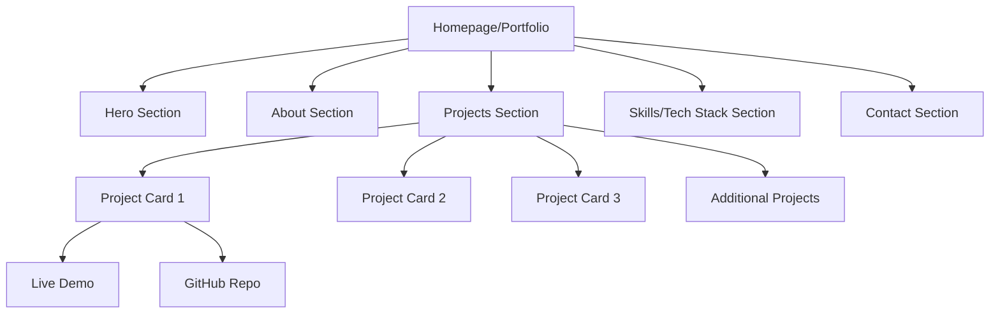
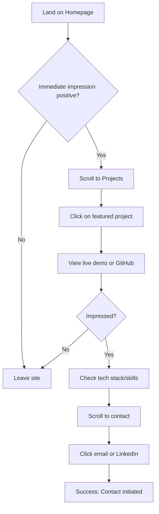
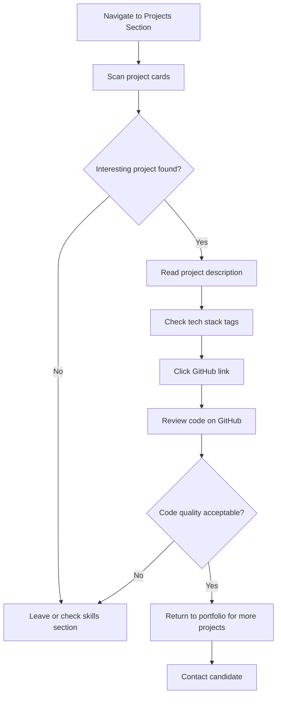
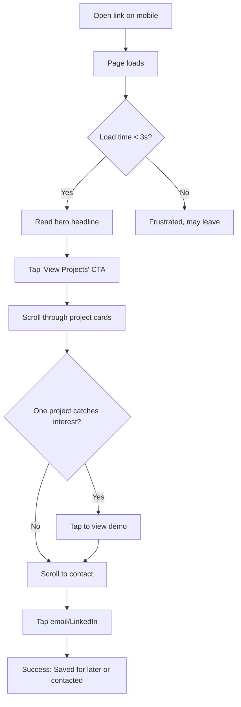

# Portfolio Website UI/UX Specification

**Project:** Portfolio Website for Web Developer
**Version:** 1.0
**Date:** October 29, 2025
**Author:** Sally (UX Expert)
**Status:** Draft

---

## Introduction

This document defines the user experience goals, information architecture, user flows, and visual design specifications for the Portfolio Website's user interface. It serves as the foundation for visual design and frontend development, ensuring a cohesive and user-centered experience.

### Overall UX Goals & Principles

#### Target User Personas

**Hiring Manager**
- Technical recruiter or engineering manager looking to quickly assess frontend skills, AI integration expertise, and cultural fit
- Needs clear evidence of technical capability in 2-3 minutes
- Scans for red flags and green lights simultaneously

**Technical Interviewer**
- Senior developer who will dig deeper into project implementations
- Wants to see code quality, architecture decisions, and problem-solving approach
- May look at GitHub repos and actual deployed projects

**Casual Visitor**
- Fellow developer or network connection who stumbled upon the portfolio
- May become advocate or referral source
- Looking for interesting projects or learning resources

#### Usability Goals

1. **Immediate clarity:** Visitor understands who you are and what you do within 3 seconds
2. **Effortless navigation:** Can find projects, skills, and contact info without scrolling confusion
3. **Trust building:** Portfolio itself demonstrates frontend competence through execution quality
4. **Performance:** Loads fast (< 2s on 3G) - portfolio performance IS the resume
5. **Accessibility:** Works perfectly with keyboard, screen readers, and on all devices
6. **Memorability:** Visitor remembers your unique value prop (frontend + AI + Rust exploration)

#### Design Principles

1. **Content over decoration** - Your work should be the star, not flashy animations
2. **Performance is a feature** - Built with Rust/WASM showcases your tech-forward thinking
3. **Clarity breeds confidence** - Simple, clear communication demonstrates senior-level thinking
4. **Subtle sophistication** - Minimal doesn't mean boring; thoughtful micro-interactions delight
5. **Mobile-obsessed** - Many recruiters browse on phones; mobile experience must be flawless

### Change Log

| Date | Version | Description | Author |
|------|---------|-------------|--------|
| 2025-10-29 | 1.0 | Initial specification created | Sally (UX Expert) |

---

## Information Architecture (IA)

### Site Map / Screen Inventory



### Navigation Structure

**Primary Navigation:** Fixed navbar at top with smooth scroll anchors
- Home (scrolls to top)
- Projects (scrolls to project section)
- Contact (scrolls to contact section)

**Secondary Navigation:**
- Social links (GitHub, LinkedIn, Email) appear in both hero and footer
- Project cards link to external destinations (live demos, GitHub repos)

**Breadcrumb Strategy:**
- Not applicable for single-page portfolio
- If blog section added in future, use breadcrumbs: Home > Blog > Post Title

---

## User Flows

### Flow 1: First-Time Visitor Evaluation

**User Goal:** Hiring manager wants to quickly evaluate if candidate is worth interviewing

**Entry Points:**
- Direct link from resume/CV
- LinkedIn profile link
- Job application portal

**Success Criteria:**
- Visitor understands your value proposition within 10 seconds
- Visitor clicks on at least one project to see details
- Visitor finds contact information easily

#### Flow Diagram



#### Edge Cases & Error Handling

- **Slow connection:** Show loading indicator, optimize images with lazy loading
- **Mobile device:** Ensure touch targets are 44px minimum, test on various screen sizes
- **Keyboard navigation:** All interactive elements must be focusable and operable without mouse
- **External links broken:** Add visual indicator if demo is down, GitHub should always work
- **Screen reader:** Proper semantic HTML and ARIA labels for all interactive elements

**Notes:** This is the most critical flow - optimize for speed and clarity. Consider adding "View Resume" CTA as secondary action if visitor wants more formal credentials.

### Flow 2: Technical Deep Dive

**User Goal:** Technical interviewer wants to assess code quality and technical decisions

**Entry Points:**
- Projects section from homepage
- Direct link to specific project GitHub repo

**Success Criteria:**
- Visitor can easily access GitHub repositories
- Tech stack for each project is clearly visible
- Visitor understands the technical complexity and your role

#### Flow Diagram



#### Edge Cases & Error Handling

- **Private repositories:** Clearly indicate "Available upon request" with note
- **Work projects under NDA:** Use placeholder with "Proprietary work" tag and detailed description
- **Outdated code:** Add timestamp/year to projects to set expectations
- **No GitHub stars/activity:** Don't display GitHub stats; focus on project quality

**Notes:** Consider adding a "View Source" link to the portfolio itself (meta - showing your Dioxus/Rust code).

### Flow 3: Mobile Quick Scan

**User Goal:** Recruiter on-the-go wants to quickly screen candidate during commute

**Entry Points:**
- LinkedIn mobile app link
- Email link on mobile device

**Success Criteria:**
- Page loads in under 3 seconds on mobile
- Hero content is immediately visible without scrolling
- CTA buttons are easily tappable
- No horizontal scrolling required

#### Flow Diagram



#### Edge Cases & Error Handling

- **Poor signal:** Progressive loading with skeleton screens
- **Small screen (iPhone SE):** Test font sizes are readable, buttons are tappable
- **Landscape orientation:** Ensure layout still works (hero may be compressed)
- **Dark mode system preference:** Respect user's OS setting (optional v2 feature)

**Notes:** Mobile experience is critical - many recruiters do initial screening on phones during commute or between meetings.

---

## Wireframes & Mockups

**Primary Design Files:** To be created in Figma (or AI-generated via v0/Lovable, then refined)

### Key Screen Layouts

#### Homepage (Desktop - 1440px width)

**Purpose:** Single-page portfolio showcasing all content in logical scroll flow

**Key Elements:**
- Fixed navbar (64px height) with logo/name and navigation links
- Hero section (100vh) with name, role, tagline, CTAs, social links
- About section (optional, ~300px height) with brief bio
- Projects section (~1200px height) with 3-column grid of project cards
- Skills section (~600px height) with categorized tech badges
- Contact section (~400px height) with CTA and contact methods
- Footer (~100px height) with copyright and links

**Interaction Notes:**
- Smooth scroll behavior between sections
- Fixed navbar appears on all sections with subtle backdrop blur
- Intersection Observer triggers fade-in animations as sections enter viewport
- Hover states on all interactive elements with subtle lift/glow effects

**Design File Reference:** [To be created]

#### Homepage (Mobile - 375px width)

**Purpose:** Same content optimized for mobile devices with single-column layout

**Key Elements:**
- Navbar collapsed or minimal (48px height)
- Hero section (80vh) with stacked content
- About section (if included) with full-width text
- Projects section with single-column card layout
- Skills section with wrapped badges
- Contact section with stacked CTA buttons
- Minimal footer

**Interaction Notes:**
- Touch-optimized button sizes (minimum 44px)
- Reduced animation complexity for performance
- Lazy load project images as user scrolls
- Consider hamburger menu if navigation grows beyond 2-3 links

**Design File Reference:** [To be created]

---

## Component Library / Design System

**Design System Approach:** Custom minimal design system tailored for portfolio, built with Tailwind CSS utility classes and custom CSS variables for theming. Not using external component library to showcase custom implementation skills.

### Core Components

#### Button Component

**Purpose:** Primary and secondary call-to-action buttons used throughout the site

**Variants:**
- `primary` - Solid blue background for primary actions (View Projects, Contact Me)
- `secondary` - Outline style for secondary actions (GitHub links, LinkedIn)
- `ghost` - Transparent with subtle hover for navbar links

**States:**
- `default` - Standard appearance
- `hover` - Slight lift (4px translateY), increased shadow, color shift
- `focus` - Blue outline ring for keyboard navigation
- `active` - Slightly depressed appearance
- `disabled` - Reduced opacity, no pointer events (rarely used)

**Usage Guidelines:**
- Use `primary` variant sparingly (1-2 per viewport)
- `secondary` buttons should outnumber primary 2:1
- Always include focus states for accessibility
- Minimum size: 44x44px for touch targets on mobile

#### Project Card Component

**Purpose:** Showcase individual projects with thumbnail, description, tech stack, and links

**Variants:**
- `featured` - Slightly larger or highlighted for top 3 projects
- `standard` - Regular size for additional projects

**States:**
- `default` - Resting state with subtle border
- `hover` - Lift up 4px, increase shadow, border glow
- `focus` - Visible focus ring when tabbed to
- `loading` - Skeleton screen while images load

**Usage Guidelines:**
- Always include alt text for project thumbnails
- Limit tech tags to 3-5 most important technologies
- Ensure both demo and GitHub links open in new tabs
- Use aspect ratio 16:9 or 2:1 for consistent thumbnail sizing

#### Tech Badge Component

**Purpose:** Display individual technologies/skills as interactive badges

**Variants:**
- `default` - Standard badge style
- `highlighted` - Used for primary skills or "Currently Learning" section

**States:**
- `default` - Neutral appearance
- `hover` - Slight scale (1.05), border color change to accent
- `focus` - Visible focus ring

**Usage Guidelines:**
- Group by category (Frontend, AI/ML, Currently Learning)
- Alphabetize within each category
- Don't overuse - focus on relevant, job-seeking technologies
- Consider linking to projects that use each technology (v2 feature)

#### Navbar Component

**Purpose:** Fixed navigation providing quick access to portfolio sections

**Variants:**
- `desktop` - Full horizontal layout with logo and links
- `mobile` - Compact or hamburger menu (if needed)

**States:**
- `default` - Semi-transparent with backdrop blur
- `scrolled` - May increase opacity or shadow when scrolled past hero
- `active-link` - Underline or highlight for current section

**Usage Guidelines:**
- Keep links to 3-4 maximum to avoid clutter
- Ensure navbar doesn't block content on mobile
- Active section highlighting helps orientation
- Use semantic `<nav>` element for accessibility

#### Social Link Component

**Purpose:** Icon links to GitHub, LinkedIn, email, etc.

**Variants:**
- `icon-only` - Just icon (used in hero and footer)
- `icon-with-label` - Icon plus text label (optional for contact section)

**States:**
- `default` - Muted color
- `hover` - Color shift to accent, slight scale up (1.1)
- `focus` - Visible focus ring

**Usage Guidelines:**
- Use consistent icon library (e.g., Heroicons, Lucide)
- Icon size: 24px in hero/footer, 20px in navbar
- Always include aria-label for screen readers
- Open external links in new tabs with rel="noopener noreferrer"

---

## Branding & Style Guide

### Visual Identity

**Brand Guidelines:** Personal brand for portfolio - minimal, professional, tech-forward aesthetic

### Color Palette

| Color Type | Hex Code | Usage |
|------------|----------|-------|
| Primary | `#3b82f6` | CTAs, links, accents, focus rings |
| Secondary | `#8b5cf6` | Gradient accents (optional), secondary highlights |
| Accent | `#10b981` | Success states, "Currently Learning" badges |
| Background Primary | `#0f1116` | Main page background |
| Background Secondary | `#1a1d24` | Section alternates, card backgrounds |
| Background Tertiary | `#24272f` | Elevated elements (hover cards) |
| Text Primary | `#ffffff` | Headings, important text |
| Text Secondary | `#b4b8c5` | Body copy, descriptions |
| Text Muted | `#6b7280` | Metadata, less important info |
| Border Subtle | `#2d3139` | Card borders, dividers |
| Border Medium | `#404552` | Hover borders, emphasized dividers |
| Error | `#ef4444` | Error states (forms, if added) |
| Warning | `#f59e0b` | Warning states |

**Color Contrast:**
- All text/background combinations meet WCAG AA standards (4.5:1 minimum)
- Primary accent (#3b82f6) provides 4.8:1 ratio on dark background
- Text secondary (#b4b8c5) provides 7.2:1 ratio - excellent readability

### Typography

#### Font Families

- **Primary:** `-apple-system, BlinkMacSystemFont, 'Segoe UI', 'Inter', sans-serif`
- **Secondary:** Same as primary (keeping it simple)
- **Monospace:** `'JetBrains Mono', 'Fira Code', 'Monaco', Consolas, monospace`

**Rationale:** Using system fonts ensures instant rendering (no font loading delay) and native feel on each platform. If custom fonts desired later, Inter is an excellent choice.

#### Type Scale

| Element | Size | Weight | Line Height |
|---------|------|--------|-------------|
| H1 | `clamp(2.5rem, 4vw + 2rem, 4rem)` (40-64px) | 700 (Bold) | 1.2 |
| H2 | `clamp(2rem, 3vw + 1.5rem, 3rem)` (32-48px) | 700 (Bold) | 1.2 |
| H3 | `clamp(1.5rem, 2vw + 1rem, 2rem)` (24-32px) | 600 (Semibold) | 1.3 |
| Body | `clamp(1rem, 0.9vw + 0.8rem, 1.125rem)` (16-18px) | 400 (Regular) | 1.5 |
| Small | `clamp(0.875rem, 0.8vw + 0.7rem, 1rem)` (14-16px) | 400 (Regular) | 1.5 |
| Button | `clamp(0.875rem, 0.9vw + 0.7rem, 1rem)` (14-16px) | 600 (Semibold) | 1.4 |
| Caption | `clamp(0.75rem, 0.7vw + 0.6rem, 0.875rem)` (12-14px) | 500 (Medium) | 1.4 |

**Fluid Typography:** Using `clamp()` ensures text scales smoothly across all viewport sizes without jarring breakpoints.

### Iconography

**Icon Library:** Heroicons v2 (or Lucide React) - modern, clean, consistent with minimal aesthetic

**Usage Guidelines:**
- Use outline style for most icons (lighter visual weight)
- Solid style for filled states (active nav items)
- Consistent 24px size for hero/social links
- 20px for navbar and smaller UI elements
- 16px for inline icons (next to text)

### Spacing & Layout

**Grid System:**
- Mobile (< 640px): Single column, 16px horizontal padding
- Tablet (640-1024px): 2-column for project cards, 24px horizontal padding
- Desktop (> 1024px): 3-column for project cards, 48px horizontal padding, max-width 1280px

**Spacing Scale:** 8px base unit
- 4px (`space-1`) - Tight spacing (icon to label)
- 8px (`space-2`) - Compact spacing (badges, form fields)
- 12px (`space-3`) - Default gap (inline elements)
- 16px (`space-4`) - Comfortable spacing (button padding)
- 24px (`space-6`) - Section padding (cards)
- 32px (`space-8`) - Navigation gaps
- 48px (`space-12`) - Between sections (mobile)
- 64px (`space-16`) - Between sections (tablet)
- 96px (`space-24`) - Between sections (desktop)

---

## Accessibility Requirements

### Compliance Target

**Standard:** WCAG 2.1 Level AA compliance

### Key Requirements

**Visual:**
- Color contrast ratios: Minimum 4.5:1 for normal text, 3:1 for large text (18px+ or 14px+ bold)
- Focus indicators: 2px solid outline with 2px offset, accent color, visible on all interactive elements
- Text sizing: All text uses rem/em units for browser zoom compatibility; no fixed pixel sizes that prevent scaling

**Interaction:**
- Keyboard navigation: All interactive elements reachable and operable via keyboard (Tab, Enter, Space)
- Screen reader support: Semantic HTML5 elements (nav, main, article, section), proper heading hierarchy (h1→h2→h3, no skipping), ARIA labels on icon buttons and links
- Touch targets: Minimum 44x44px on mobile devices, adequate spacing between adjacent targets (8px minimum)

**Content:**
- Alternative text: All images have descriptive alt attributes; decorative images use empty alt=""
- Heading structure: Logical hierarchy with single h1 (page title), subsequent sections use h2, subsections use h3
- Form labels: If contact form added, all inputs must have associated labels (explicit or aria-label)

**Motion & Animation:**
- Respect `prefers-reduced-motion` media query
- Disable/minimize animations for users who request reduced motion
- Ensure no auto-playing animations that could cause vestibular issues

### Testing Strategy

**Manual Testing:**
1. Keyboard navigation: Tab through entire page, verify all interactive elements are reachable and have visible focus
2. Screen reader: Test with VoiceOver (macOS/iOS) or NVDA (Windows)
3. Color contrast: Use WebAIM Contrast Checker or browser DevTools
4. Zoom test: Test at 200% browser zoom, ensure no content cutoff

**Automated Testing:**
1. Lighthouse accessibility audit (aim for 100 score)
2. axe DevTools browser extension
3. WAVE accessibility evaluation tool

**User Testing:**
- If possible, recruit users with disabilities for feedback
- Test with keyboard-only navigation (no mouse)
- Test with screen reader on actual devices

---

## Responsiveness Strategy

### Breakpoints

| Breakpoint | Min Width | Max Width | Target Devices |
|------------|-----------|-----------|----------------|
| Mobile | 320px | 639px | iPhone SE, smaller Android phones, portrait view |
| Tablet | 640px | 1023px | iPads, Android tablets, landscape phones, small laptops |
| Desktop | 1024px | 1279px | Standard laptops, small monitors |
| Wide | 1280px | - | Large monitors, external displays, ultrawide screens |

### Adaptation Patterns

**Layout Changes:**
- Mobile: Single-column layout throughout, full-width cards, stacked elements
- Tablet: 2-column grid for project cards, comfortable reading width for text content
- Desktop: 3-column grid for project cards, wider container with max-width constraint
- Wide: Same as desktop with increased horizontal padding, centered content

**Navigation Changes:**
- Mobile: Consider hamburger menu if links exceed 3 items; compact spacing; reduced font size
- Tablet: Full navbar with slightly reduced padding
- Desktop: Full navbar with generous spacing
- Wide: Navbar remains fixed-width (doesn't stretch to full width)

**Content Priority:**
- Mobile: Hero CTA buttons stack vertically on very small screens (<400px); project descriptions limited to 2 lines with ellipsis; tech tags may wrap to multiple lines
- Tablet: More comfortable text line length (60-75 characters)
- Desktop: Optimal reading width, all content visible without truncation

**Interaction Changes:**
- Mobile: Touch targets minimum 44px; increased tap padding; reduced hover effects (focus on tap states)
- Tablet: Hybrid touch/mouse support
- Desktop: Full hover effects; precise click targets; keyboard navigation optimized

---

## Animation & Micro-interactions

### Motion Principles

**Purposeful Motion:**
- Every animation serves a purpose: guide attention, provide feedback, or indicate state change
- Avoid gratuitous animation that distracts from content

**Performance First:**
- Only animate transform and opacity (GPU-accelerated)
- Avoid animating layout properties (width, height, top, left)
- Use `will-change` sparingly and only during active animations

**Subtle & Sophisticated:**
- Prefer subtle easing curves (ease-in-out, custom cubic-bezier)
- Shorter durations (150-350ms) feel snappy and responsive
- Longer durations (400-600ms) for page load sequences

**Respect User Preferences:**
- Honor `prefers-reduced-motion` media query
- Disable/minimize all animations for users who request it

### Key Animations

- **Page Load Sequence:** Hero content fades up sequentially - name (400ms), role (500ms), tagline (600ms), CTAs (700ms), social links (800ms) | Duration: 400ms | Easing: ease-out
- **Section Fade-In:** Sections fade in as they enter viewport using Intersection Observer | Duration: 600ms | Easing: ease-out
- **Project Card Hover:** Card lifts up 4px with increased shadow | Duration: 250ms | Easing: cubic-bezier(0.4, 0, 0.2, 1)
- **Button Hover:** Slight scale (1.02) with shadow increase | Duration: 200ms | Easing: ease-in-out
- **Button Press:** Scale down to 0.98 for tactile feedback | Duration: 100ms | Easing: ease-out
- **Smooth Scroll:** Anchor links scroll smoothly to section | Duration: 800ms | Easing: ease-in-out
- **Tech Badge Hover:** Scale to 1.05 with border color change | Duration: 150ms | Easing: ease-out
- **Social Icon Hover:** Scale to 1.1 with color shift | Duration: 150ms | Easing: ease-out
- **Navbar Backdrop:** Blur effect fades in when scrolling past hero | Duration: 300ms | Easing: ease-in-out

---

## Performance Considerations

### Performance Goals

- **Page Load:** Time to Interactive (TTI) < 2 seconds on 3G connection
- **Interaction Response:** All interactions respond within 100ms (perceived as instant)
- **Animation FPS:** Maintain 60fps for all animations and scroll interactions

### Design Strategies

**Image Optimization:**
- Use WebP format with PNG/JPG fallbacks
- Serve responsive images with `srcset` attribute (multiple sizes)
- Lazy load project thumbnails using `loading="lazy"` attribute
- Optimize image dimensions: project cards max 800x450px
- Consider using placeholder blur-up technique for gradual loading

**Font Loading:**
- Prefer system font stack (zero load time, native rendering)
- If custom fonts used: `font-display: swap` to prevent FOIT (Flash of Invisible Text)
- Preload critical font files with `<link rel="preload">`

**Code Optimization:**
- Minimize initial bundle size (aim for < 200KB gzipped)
- Leverage Dioxus/WASM performance advantages
- Use code splitting for blog route if implemented in future
- Defer non-critical CSS (e.g., blog styles if not on homepage)

**Rendering Performance:**
- Use CSS containment (`contain: layout paint`) on project cards
- Avoid layout thrashing (batch DOM reads/writes)
- Debounce scroll event listeners if needed
- Use Intersection Observer instead of scroll listeners for animations

**Caching Strategy:**
- Set appropriate cache headers for static assets
- Use service worker for offline support (optional v2 feature)
- Cache project images aggressively (they rarely change)

---

## Next Steps

### Immediate Actions

1. **Review and approve this specification** with stakeholders (you!)
2. **Create visual designs** using AI tools (v0, Lovable) or Figma for key components
3. **Implement design system** in Dioxus with Tailwind CSS and CSS variables
4. **Build components** following the specifications: Navbar → Hero → ProjectCard → Skills → Contact → Footer
5. **Add real content** (project descriptions, images, tech stacks, contact info)
6. **Test thoroughly** across devices and accessibility tools
7. **Deploy** to production hosting (Vercel, Netlify, or GitHub Pages)

### Design Handoff Checklist

- [x] All user flows documented
- [x] Component inventory complete
- [x] Accessibility requirements defined
- [x] Responsive strategy clear
- [x] Brand guidelines incorporated
- [x] Performance goals established

---

## Appendix: Technical Implementation Notes

### Dioxus Component Structure

```
src/
├── components/
│   ├── navbar.rs       (Fixed navigation)
│   ├── hero.rs         (Hero section with CTAs)
│   ├── about.rs        (Optional brief bio)
│   ├── project_card.rs (Individual project showcase)
│   ├── projects.rs     (Projects grid container)
│   ├── skills.rs       (Tech stack badges)
│   ├── contact.rs      (Contact CTAs)
│   ├── footer.rs       (Footer with credits)
│   └── mod.rs
├── views/
│   ├── home.rs         (Main page composition)
│   └── mod.rs
├── data/
│   └── projects.rs     (Project data structures)
├── assets/
│   ├── projects/       (Project thumbnails)
│   └── icons/          (Social icons)
└── main.rs
```

### Project Data Structure (Rust)

```rust
#[derive(Clone, Debug, PartialEq)]
pub struct Project {
    pub id: u32,
    pub title: String,
    pub description: String,
    pub thumbnail: String,
    pub tech_stack: Vec<String>,
    pub live_url: Option<String>,
    pub github_url: Option<String>,
    pub featured: bool,
    pub year: u32,
}

// Example usage:
pub fn get_projects() -> Vec<Project> {
    vec![
        Project {
            id: 1,
            title: "AI Chat Assistant".to_string(),
            description: "Real-time chat interface with OpenAI integration, streaming responses, and conversation history.".to_string(),
            thumbnail: "/assets/projects/ai-chat.webp".to_string(),
            tech_stack: vec![
                "React".to_string(),
                "TypeScript".to_string(),
                "OpenAI API".to_string(),
                "Tailwind CSS".to_string(),
            ],
            live_url: Some("https://example.com/demo".to_string()),
            github_url: Some("https://github.com/username/ai-chat".to_string()),
            featured: true,
            year: 2025,
        },
        // ... more projects
    ]
}
```

### CSS Variables Implementation

Create a `design-system.css` file:

```css
:root {
  /* Colors */
  --bg-primary: #0f1116;
  --bg-secondary: #1a1d24;
  --bg-tertiary: #24272f;
  --text-primary: #ffffff;
  --text-secondary: #b4b8c5;
  --text-muted: #6b7280;
  --accent-primary: #3b82f6;
  --accent-hover: #60a5fa;
  --border-subtle: #2d3139;
  --border-medium: #404552;

  /* Spacing */
  --space-1: 0.25rem;
  --space-2: 0.5rem;
  --space-3: 0.75rem;
  --space-4: 1rem;
  --space-6: 1.5rem;
  --space-8: 2rem;
  --space-12: 3rem;
  --space-16: 4rem;
  --space-24: 6rem;

  /* Typography */
  --font-primary: -apple-system, BlinkMacSystemFont, 'Segoe UI', sans-serif;
  --font-mono: 'JetBrains Mono', Monaco, monospace;

  /* Animations */
  --duration-fast: 150ms;
  --duration-normal: 250ms;
  --duration-slow: 350ms;
  --ease-in-out: cubic-bezier(0.4, 0, 0.2, 1);
}

/* Reduced motion preference */
@media (prefers-reduced-motion: reduce) {
  *,
  *::before,
  *::after {
    animation-duration: 0.01ms !important;
    animation-iteration-count: 1 !important;
    transition-duration: 0.01ms !important;
  }
}
```

### Smooth Scroll Implementation

In your main.css:

```css
html {
  scroll-behavior: smooth;
}

/* Disable smooth scroll for users who prefer reduced motion */
@media (prefers-reduced-motion: reduce) {
  html {
    scroll-behavior: auto;
  }
}
```

### Accessibility Focus Styles

```css
/* Global focus styles for keyboard navigation */
*:focus-visible {
  outline: 2px solid var(--accent-primary);
  outline-offset: 2px;
  border-radius: 2px;
}

/* Remove default outline */
*:focus {
  outline: none;
}
```

---

## Summary

This specification defines a **minimal, professional portfolio** optimized for landing a full-time frontend development role. The design emphasizes:

- **Clarity & Speed:** Immediate value proposition, fast load times
- **Technical Credibility:** Built with Dioxus/Rust showcases modern tech skills
- **Accessibility:** WCAG AA compliant, keyboard navigable, screen reader friendly
- **Mobile-First:** Perfect experience on all devices, especially mobile
- **Performance:** Leverages Rust/WASM advantages for blazing-fast experience

**Key Differentiators:**
1. **Tech Stack Choice:** Using Dioxus/Rust instead of React/Next.js shows technical curiosity
2. **Frontend + AI Expertise:** Dual specialization addresses current market demand
3. **Learning Journey:** Highlighting Rust exploration demonstrates growth mindset
4. **Portfolio as Resume:** The site itself proves your frontend competence

**Next Step:** Generate AI prompts for rapid UI prototyping, then implement in Dioxus following this spec.

---

**End of Specification**
